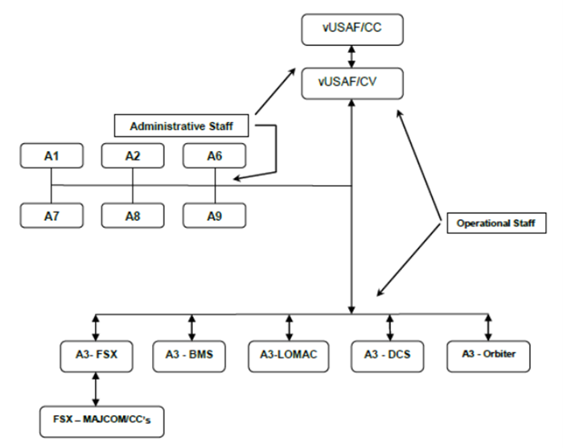
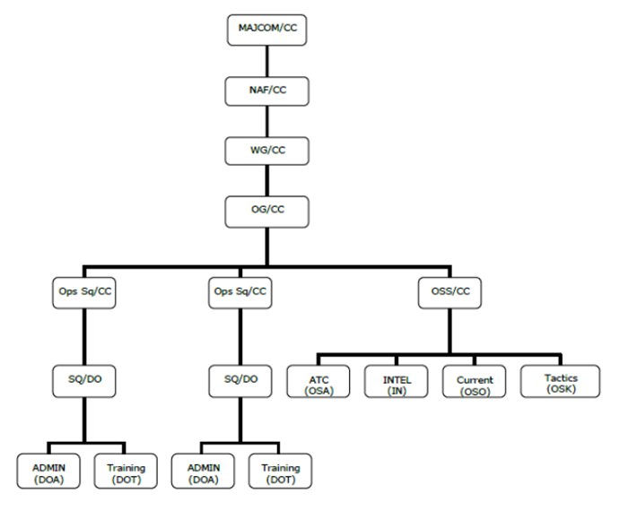
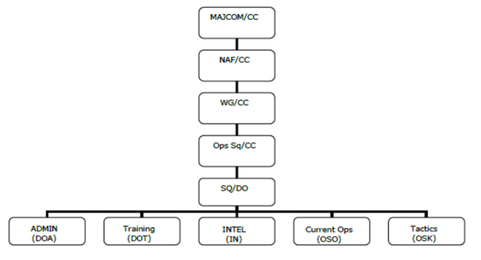

# vAFI 38-101 Chain-of-Command & Responsibilities

COMPLIANCE WITH THIS INSTRUCTION IS MANDATORY

!!! info "Revision Info"
    - Document Number: vAFI 38-101
    - Date: 10 Jun 2019
    - OPR: vUSAF/CS
    - Supersedes: 01 Jan 2005, 03 Feb 2006, 03 Dec 2011, 25 Nov 2013, 10 Apr 2018
    - Certified by: Chief of Staff

1. **Purpose:** The purpose of this document is to outline in detail the administrative structure of the Virtual United States Air Force. This guidance will describe in detail the component structures and their respective positions and duty descriptions.

2. **Organizational entities:** The Virtual United States Air Force (vUSAF) is comprised of establishments, units and non-units.

    1. **Establishment:** An organizational entity consisting of a headquarters unit and its subordinate units. The name of the establishment is in the name of the headquarters units. For example, Air Mobility Command (AMC) is an establishment; HQ AMC is its headquarters. Subordinate units are assigned to the establishment and not its headquarters unit.

        1. A group with subordinate squadrons is generally the lowest-level establishment. Lower-level establishments are assigned to higher-level ones; for example, Groups to Wings, Wings to NAFs, MAFs to MAJCOMs, MAJCOMs to HQ vUSAF. This arrangement (units reporting to establishments, subordinate units' establishments to superior ones) sets up the Chain of Command (CoC) through which, all accountability and control flow.

        2. Establishments facilitate organizational actions. For example, the reassignment of a wing (establishment) from one NAF to another automatically reassigns the wing's subordinate units.

    2. **Unit:** A military organization constituted by directives issued by HQ vUSAF. A unit is either named or numbered.

        1. A unit helps provide for an unbroken chain of command (CoC) since military personnel must be assigned to a unit at all times. Each unit having military members must have an officer designated as its commander.

        2. Terms that apply to a unit:

            1. **Active unit:** A major command (MAJCOM) constituted and activated by HQ vUSAF; or a subordinate unit constituted by HQ vUSAF, assigned to a MAJCOM, and activated by special order.

            2. **Inactive unit:** A unit constituted by HQ vUSAF but not yet activated or a unit constituted, activated and subsequently, inactivated.

            3. **Disbanded unit:** A unit whose legal authority for existence has been withdrawn by HQ vUSAF. Its designation is retired and preserved in historical records.

            4. **Parent unit:** An organization that directly administers units, detachments, or operating locations assigned to it.

            5. **Provisional unit:** A temporary unit organized to perform a specific task.

            6. **Attached unit:** A unit, or part of a unit, placed under the control of another organization for the specific purpose such as operational control, administrative control, or logistical support. It is the assigned to the parent unit.

            7. **Detached unit:** A unit serving away from its organization of assignment. It may function independently or may be attached to another organization.

            8. **Primary subordinate unit:** A unit that performs part or the entire primary mission of the organization to which it is assigned. The unit reports to the commander of the parent organization and has full authority to execute its assigned mission.

3. **vUSAF organization:** The organization of the vUSAF does not fully duplicate the real structure of the United States Air Force since the vUSAF is a virtual, hobby orientated organization using flight simulators and the internet, thus some areas of the actual United States Air Force are not needed or have no practical function in the virtual world. It shall be noted that the vUSAF shall be operated as closely as possible to that of the actual United State Air Force in its peacetime role. With a high regard for prototypical operation thereof. See the attached diagram at the end of this document labeled 13.1.

    **Headquarters vUSAF Staff Organization**

    1. **vUSAF Chief-of-Staff (vUSAF/CS).** Responsible for the overall operation and Senior representative of the vUSAF. Shall retain the call sign of **A1000**.

    2. **Vice Chief of Staff (vUSAF/VCS)**. Reports directly to the Chief of Staff and supervises the activities of the Air Staff. The VCS is the second in command in the absence of the Chief-of-Staff. This office shall retain the call sign of **A1001**. vUSAF/VCS will ensure that all discharged non AETC student pilots receive an exit interview prior to archive of records.

    3. **Director of Air and Space Operations (vUSAF/A3)**. Is an operational position that is responsible to the Chief of Staff for daily operations of a segment of the vUSAF (i.e. FSX, BMS and etc.). The position is also responsible for determining operational requirements, activities, capabilities and training necessary to support vUSAF operations within the assigned segment of the vUSAF. This office shall retain the call sign of **A1003** and the air staff identifier **A3**. This office is subject to expansion through the addition of additional personnel as the need arises to ensure the mission of the position is fulfilled. Appointments of additional personnel shall be in accordance to vAFI 36-103 and subject to final approval by the Chief of Staff. An A3 position shall be created for each simulation platform-based segment of the vUSAF (i.e., FSX, BMS and etc.), subsequent establishment of the Command and Control (CoC) for a specific segment shall be determined by the Chief of Staff.

    4. **Director for Plans and Programs (vUSAF/A8)**. Is an administrative position with a unique requirement of working with all segments of the vUSAF to establish and maintain an annual list of activities and events. This office shall, at the request of each segment, assist with the generation of media for activities and events. This office may, at the request of a segment, assist in the administrative duties of such activities and events. This office may be assigned by the vUSAF/CS or VCS to generate and administer an activity or event for any segment of the vUSAF as they see fit. This office is under the direct supervision of the vUSAF/CS and VCS. Appointments of additional personnel shall be in accordance to vAFI 36-103 and subject to final approval by the Chief of Staff. This office shall retain the call sign of **A1008** and the air staff identifier of **A8**.

    5. **Director of Personnel (vUSAF/A1)**. Is an administrative position that is responsible for all administrative functions of the vUSAF and the website. The vUSAF Chief of Personnel and staff receive new pilot applications, determines their pilot number, rank, hours and duty assignment. He sends welcome letters to new pilots and advises pertinent personnel of his actions. The Chief of Personnel through operational commanders, shall document delinquent pilots and delete them from the roster. This office shall retain the call sign of **A1004** and the air staff identifier of **A1**. This office is subject to expansion through the addition of additional personnel as the need arises to ensure the mission of the position is fulfilled. Appointments of additional personnel shall be in accordance to vAFI 36-103 and subject to final approval by the Chief of Staff. A1 will ensure that each submitted ticket has a response within 24 hours and a completion time of 72 hours (may be waived by VCoS/CoS for certain instances). For those tickets that do not have a response in 24 hours it is the duty of A1 to inquiry why by contacting individual the ticket has been transferred to. Will ensure that VCoS receives a help ticket for non AETC student pilots who are discharged from the vUSAF.

    6. **Director of vUSAF Public Affairs & Historical Research (vSAF/PA - A9)**. Is an administrative position assigned the primary role of compiling and disseminating information about the vUSAF and release the information to the virtual community at large. The purpose of disseminating the information is to introduce the vUSAF to the public, inspire members of the virtual community to enlist in the vUSAF and to inform the virtual community on the activities of the vUSAF. This office is located at Maxwell AFB, AL, this office also serves as the Virtual Air Force's historical resource for the study, promotion and execution of airpower. Records and disseminates vUSAF history to further this office\'s mission of informing the public about the vUSAF but also to educate the members of the vUSAF as well. This office shall retain the call sign of **A1009** and the air staff identifier **A9**. This office is subject to expansion through the addition of additional personnel as the need arises to ensure the mission of the position is fulfilled. Appointments of additional personnel shall be in accordance to vAFI 36-103 and subject to final approval by the Chief of Staff.

    7. **Director Virtual Air Force Operational Test and Evaluation Center (vSAF/IE - A6)**. The Air Force Operational Test and Evaluation Center is a direct reporting unit (DRU) under Virtual Air Force Headquarters and is situated at Kirtland AFB in Albuquerque NM. It is the Air Force\'s independent test agency responsible for testing new systems such as aircraft, scenery design, Air Traffic Control files, and other areas designated by the Air Staff to improve the combat capability of aircraft the vUSAF. This office shall retain the call sign of **A1006** and the air staff identifier **A6**. This office is subject to expansion through the addition of additional personnel as the need arises to ensure the mission of the position is fulfilled. Appointments of additional personnel shall be in accordance to vAFI 36-103 and subject to final approval by the Chief of Staff. AFOTEC will operate out of the following locations:

        1. Headquarters AFOTEC - Kirtland AFB, NM (Scenery and ATC files)

        2. Detachment 1 -Eglin AFB, FL (Weapons)

        3. Detachment 2 -Edwards AFB, CA (Aircraft)

    8. **Director of Logistics and Mission Support (vDLMS/CRAF - A7)**. This office is responsible for the allocation and management of VUSAF assets and Civilian Reserve Air Fleet (CRAF) assets that support vUSAF operations. Duties include assignment of vUSAFHQ missions to all cargo and personnel assets and CRAF partners of day-to-day missions. This office will coordinate mobility of assets per the direction of A3/8 during vUSAF sponsored events or other attending events that require use of vUSAF assets. A7 will be expected to produce monthly HQ mission assignments. Member may be subjected to complete special missions as required by vUSAF CS/VCS as required. A7 has the authority to produce missions of all security types and may authorize movement of assets into any location as required to maintain proper wartime readiness to include civil airports. Only VIP/SAM missions may RON at civil airports. If no suitable military airbase or within a crew duty day flight non-VIPSAM missions may RON at civil airports on a limited base and A7 should try to plan missions to avoid this situation if at all possible. This office shall retain the call sign of **A1007** and the air staff identifier **A7.**

    9. **Director of Web Site operations (vUSAF/A2).** This office is responsible for the generation and maintenance of all organizational web assets. This office shall also oversee subordinate unit web assets in accordance to vUSAF policy. This office with permission of the vUSAF/CS may delegate the daily operation of unit level web assets through pre-arranged and acceptable secure means. This office shall retain the call sign of **A1005** and the air staff identifier **A2**. This office is subject to expansion through the addition of additional personnel as the need arises to ensure the mission of the position is fulfilled. Appointments of additional personnel shall be in accordance to vAFI 36-103 and subject to final approval by the Chief of Staff.

4. **Major Command (MAJCOM).** The MAJCOM Commanders are responsible to the vUSAF/A3 for all actions and occurrences within their command. This includes operations, support and personnel issues. See the attached diagram at the end of this document labeled 13.1. Each MAJCOM Commander is also responsible for correct parking of all tail numbers assigned within the ACMI system under their command to include but not limited to crashed or improperly parked airplanes. MAJCOM Commanders will also assign parking spaces are assigned to their pilots and will develop a plan to routinely check for compliance. When removing member from unit a ticket is required to be sent to VCoS for exit interview and tracking purposes.

    1. **Commander, Air Combat Command (ACC/CC).** Responsible for continuation training and maintaining a CONUS-based combat-ready forces for rapid deployment and employment while ensuring strategic air defense forces are ready to meet the challenges of peacetime air sovereignty and wartime air defense.

    2. **Commander, Air Education and Training Command Commander (AETC/CC).** Responsible for of all new vUSAF pilots admitted into the vUSAF\'s Undergraduate Pilot Training Program (PTP). AETC/CC shall also be responsible for ensuring Instructor Pilots (IP) maintain a minimum standard of activity as an Instructor to ensure competency.

    3. **Commander, Air Mobility Command (AMC/CC).** Responsible for providing airlift, air refueling, special air mission and aero medical evacuation for U.S. forces. Supplies forces to theater commands to support operational taskings.

    4. **Commander, Air Force Reserve Command (AFRC/CC).** Responsible for providing part time citizen airmen to defend the United States and protect its interests through augmenting the other MAJCOMs.

    5. **Commander, Air Force Reserve Command (AFRC/CC).** Responsible for providing part time citizen airmen to defend the United States and protect its interests through augmenting the other MAJCOMs.

    6. **Commander, Air National Guard (ANG/CC).** Responsible for providing part time citizen airmen to defend the United States and protect its interests through augmenting the other MAJCOMs.

    7. **Commander, Air Force Special Operations Command (AFSOC/CC).** Responsible for providing combat search and rescue, agile combat support, information warfare, precision aerospace fires, psychological operations, specialized aerospace mobility and refueling to unified commands and delivers special operations power anytime, anywhere.

    8. **Commander, Pacific Air Forces (PACAF/CC).** Responsible for providing ready air and space power to promote U.S. interests in the Asia-Pacific during peacetime, crisis and in war.

    9. **Commander, US Air Forces Europe (USAFE/CC).** Responsible for providing responsive forward presence and decisive air and space power. Plans, conducts, controls, coordinates and supports air and space operations to achieve U.S. and NATO objectives in the European Theater.

    10. **Commander, Air Force Global Strike Command (AFGSC/CC).** Responsible for continuation training and maintaining a CONUS-based combat-ready strategic forces for rapid deployment and employment for the purposes of projecting a global strategic strike capability with the ultimate goal to preserve the interests of the United States.

5. **Numbered Air Forces Commander (NAF\*/CC).** Responsible for all operational requirements, planning, missions, and other items that are delegated to the NAF from the MAJCOM/CC. Wing Commanders report to their respective NAF/CC that they are assigned to with all operational items, and may advise the NAF/CC of all administrative items within their respective areas. Items affecting the overall vUSAF shall be forwarded to the MAJCOM/CC with a recommendation.

6. **Tanker Airlift Control Center (TACC).** Responsible to Headquarters Air Mobility Command and is located at Scott Air Force Base. TACC is the command's hub for planning and directing tanker and transport aircraft operations around the world. Created to centralize command and control responsibilities TACC is dedicated to providing quality service for airlift, air refueling and aero medical missions. TACC is also responsible for the tasking of operational missions to the Air National Guard and Air Force Reserve tanker and airlift forces.

7. **Wing Commanders (WG/CC)**. The Wing Commanders are responsible to the appropriate NAF for all assets under their command. Each Wing Commander manages the groups and squadrons under their command and makes recommendations to NAF for advancements and operational changes. They are also responsible for matters related to personnel. These areas include resignations, leaves of absence and dismissal. Wing Commanders will also coordinate with the wing staff to designate a weekly flight that the wing holds as an online flying training event.

    1. **Wing Commander Responsibilities:**

        1. **Pilot Management:** Each Wing should maintain a current roster of all pilots within their respective wing. MISREPs submitted by pilots under his wing should be reviewed frequently and any inactive pilot activity noted. Communication between Group/Squadron Commanders and Wing Commanders is essential. The squadron manning levels should be no more than 10 pilots per squadron. When a squadron becomes full, the NAF will be notified so a new squadron can be activated.

        2. **Operations:** Operational taskings may be assigned to squadrons at any time. Major operational tasking, such as joint service exercises or vUSAF deployments may not be modified without the permission of NAF. Wings will also forward pilot availability for upcoming events to the NAF.

        3. **Communications:** Constant communications with Group and Squadron Commanders is paramount. Take recommendations and honestly review them for inclusion or deletion. Support them for all needs and work through problems if they develop. Work with other Operations Group and Wing Commanders for operational taskings.

    2. **Operations Group Commander (OG/CC).** The Operations Group will be activated when a Wing has two or more active and/or reserve flying squadrons and an operational support squadron. The Operations Group Commander assists the Wing Commander in the day-to-day operations of the assigned squadrons and in his absence assumes command of the wing.

    3. **Operations Support Squadron (OSS) Composition.** When there are two or more active and/or reserve flying squadrons assigned to a Wing, an Operations Support Squadron (OSS) will be activated. The overall mission of the OSS is to support the flying squadrons. The OSS is comprised of an OSS Commander (OSS/CC) who is ultimately responsible for the pilots and controllers in their respective squadrons. Their staff may include, but are not limited to Airfield Operations (OSA), Current Operations Officer (OSO), Intelligence Officer (IN) and Tactics Officer (OSK).

    4. **Flying (OPS) Squadron Composition.** A flying squadron is composed of a Squadron Commanders (SQ/CC) who is ultimately responsible for pilots in their respective squadrons. Their staffs may include, but are not limited to an Operations Officer (DO), Administrative Officer (DOA), Training Officer (DOT), Intelligence Officer (IN), Tactics Officer (OSK) and other positions as deemed necessary for the efficient functioning of a squadron. When an Operations Support Squadron is active, the Intelligence Officer (IN) and Tactics Officer (OSK) positions will be assigned to them.

8. **Squadron Commander (SQ/CC).** The SQ/CC is responsible to the appropriate OG/CC or WG/CC for all matters pertaining to their squadron. Ensures squadron personnel have completed or are scheduled to complete mission training requirements. Plans and approves squadron flights.

    1. **Responsibilities.** SQ/CC responsibilities include, but are not limited to:

        1. Ensures assigned squadron personnel are fully trained in all aspects of their assigned aircraft.

        2. Recommends personnel for accelerated or meritorious advancements and makes award recommendations for those pilots who show exemplary conduct.

        3. Rotates Squadron personnel to fill positions as required.

        4. Plans and conducts a minimum of 1 on-line (VATSIM or Private Server) operations/training missions each month. Maintains a goal of a minimum of 80% of personnel participating.

        5. Encourage pilots to fly once a week if they possibly can. Solicit input for new operations, advancements and other areas that will enhance the operation of the squadron. In addition, you are required to remain current in your particular aircraft you are authorized to fly.

        6. Ensures squadron personnel maintain currency requirements per vAFI 11-202.

        7. Ensures new members receive a "welcome letter" to the squadron and are immediately scheduled for training.

        8. Submits a monthly Situation Report (SITREP) to the appropriate OG/CC or WG/CC on the status of their squadron.

        9. Report all separations and resignations of their pilots to their appropriate OG/CC or WG/CC. Include as much information as to the circumstances as possible.

        10. Shall be proficient in flying and utilizing Multiplayer software. Assist and encourage pilots in learning how to conduct flight online.

    2. **Squadron Staff Positions:**

        1. **Operations Officer (SQ/DO).** The SQ/DO assists the SQ/CC in the day-today operations of the squadron. Oversees all squadron officers to ensure duties are completed as required. Acts as the SQ/CC in his absence.

        2. **Administrative Officer (DOA).** Responsible for all matters pertaining to personnel in the Squadron. Maintains the squadrons website, readiness board and ensures personnel are submitting PIREPS as required per vUSAF instructions.

        3. **Training Officer (DOT).** Responsible for all squadron training matters, to include scheduling new pilots for mission training and the creation of "canned" local training flights. With help of DOA, tracks currency training and informs the SQ/DO of pilots that are non-current.

        4. **Intelligence Officer (IN).** Provides intelligence support during all phases of operations. Prepares the wing for exercise and operational missions. Provides threat assessments and assists combat aircrews in applying intelligence to successfully accomplish missions.

        5. **Airfield Operations (OSA).** Provides airfield management and air traffic operations services to the base flying wing transient and civil users. These services can include clearance delivery, ground control tower, radar operations, and base operations functions. Also is responsible for establishing a Letter of Agreement (LOA) between the local ARTCC and airfield.

        6. **Current Operations (OSO).** Responsible for all wing flying operations. Monitors and directs flying, scheduling, and training. Coordinates wing exercise and operational mission planning and sortie allocation. Coordinates deployment requirements for the Operations Group.

        7. **Tactics Officer (OSK).** Develops procedures and unit tactics for planning and employing operational mission and wing assets. Advises wing staff on operational capabilities, limitations, and status of resources.

9. **Member - Rated.** A member of the vUSAF who has completed the vUSAF Pilot Training Program and is assigned to a unit within the vUSAF as a pilot. A member - Rated, also known as a \"line member\" are required to maintain currency in their assigned aircraft in accordance to policy, and to maintain the below minimum level of activity dependent on the below criteria:

    1. Active Duty - All other MAJCOM not listed in this section: Four (4) Flights a month.

    2. Reservists - (AFRC) Two (2) flights per month and two weeks of active duty per calendar year.

    3. Guardsman - (ANG) One (1) flight per month and two weeks active duty per calendar year.

10. **Member - Non-rated.** Is a member who is accepted into the vUSAF and is NOT a rated virtual pilot by vUSAF standards however, is permitted to be enlisted into the vUSAF when such person possesses skills / resources deemed valuable to the interests of the vUSAF (i.e., web technicians, etc). Such personnel appointments shall only be generated by the vUSAF/CS with the interest of the vUSAF at the core of said appointment. A person appointed to a position within the vUSAF as a non-rated member, shall NOT be permitted to fly using their identification as a vUSAF member. Said personnel may be eligible for appointment to any rank within the spectrum of E-1 to O-8 at the pleasure of the vUSAF/CS. Members are appointed this status by the vUSAF/CS in the interest of the vUSAF as a whole and are subject to review on an annual basis for viability and necessity.

11. **Wing and Squadron Web Pages.** Wings and Squadrons are highly encouraged to develop their own web pages. This promotes \"espirit de corps\" with an active wing and their accomplishments. Any unit wishing to open a wing or squadron web page shall first obtain permission from the vUSAF/CS or designee, every effort shall be made to host such pages on approved vUSAF servers prior to authorizing a web page hosted on a non-vUSAF server. Lastly, all web pages are subject to the terms and condition of the vUSAF contributor\'s agreement.

12. **Position Vacancies and Removals.** Vacancies within the chain of command are subject to the policy and procedures as outlined within vAFI 36-103 and shall be filled / removed in accordance to that policy.

13. **Chain of Command Diagrams**

    1. **Air Staff Diagram**

        

    2. **Layout for a Wing with 2 or more flying Squadrons**

        

    3.  **Layout for a Wing or Group with one flying Squadron**

        

// Signed //

Chief of Staff
