# vAFI 36-102 vUSAF Awards Policy

COMPLIANCE WITH THIS INSTRUCTION IS MANDATORY

!!! info "Revision Info"
	- Document Number: vAFI 36-102
	- Date: 01 June 2018
	- OPR: vUSAF/CS
	- Supersedes: 10 Oct 2005, 21 Apr 2008, 20 Nov 2008, 20 Oct 2011, 24 Feb 2012, 03 Mar 2013
	- Certified by: Chief of Staff

1. **Purpose:** The purpose of this instruction is to establish the criteria by which the vUSAF recognition and awards program is administered.

2. **DEFINITIONS**

    1. **Service Award.** Award issued to members in recognition of continuous service. The Director of Personnel normally issues these awards.

    2. **Training Award.** Award earned through the completion of various parts of the vUSAF Education and Training Program. The Commander of AETC normally issues these awards.

    3. **Performance Award.** Award issued to recognize exceptional performance. The Chief of Staff normally issues these awards upon recommendation by the Review Board.

    4. **Participation Award.** Award issued to recognize participation in vUSAF or VSOA exercises and operations.

3. **INTRODUCTION:** Awards have been a significant part of all military organizations. They proclaim that the wearer has distinguished himself in some way and deserves recognition and respect. The vUSAF, being a virtual military organization, also seeks to reward its personnel for performance and dedication. Awards recognizing specific acts should be bestowed as soon as possible after achievement.

4. **AWARDS CRITERIA:** Criteria for performance awards are listed below for sustained exercises and missions, the Chief of Staff and Review Board (if convened) will establish and apply consistent policies for the awarding of performance awards. Service and Training Awards are awarded automatically based upon service and training records.

5. **COMMAND RESPONSIBILITY:** It is the responsibility of every Commander to track the service, participation, and performance of the members under their Command, and make recommendations for promotion and recognition to their Commanding Officer. Recognition encourages greater participation by members of the Organization. Accordingly, promotion and recognition should be considered a primary responsibility of those in Command positions.

6. **AUTHORITY:** The final authority for issuance of awards rests with the Chief of Staff. The Chief of Staff may convene a Review Board to assist in reviewing recommended awards. Detailed information concerning the Review Board is found at the end of this document.

7. **PROCESS:** The Commanding Officer at any level; Squadron, Wing, NAF, MAJCOM and Airstaff can recommend an award for a pilot or a unit. These recommendations must be sent up the Chain of Command.

8. **COMMENDATION:** It is the responsibility of the recommending officer (SQN/CC, WG/CC, NAF/CC, MAJCOM/CC, or AIRSTAFF) to write the commendation explaining why the pilot should receive the recommended award. This should be written in the approved format. AFPC/COS may edit the final award commendation.

9. **VUSAF PERFORMANCE AWARDS:**

    1. **Meritorious Service Award**

        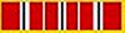 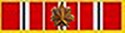

        1. **Purpose:** To recognize leaders within the vUSAF who have distinguished themselves by meritorious and exceptional duty and who have made notable contributions to the Organization at the highest levels.

        2. **Criteria:** The vUSAF Meritorious Service Award shall be awarded to senior officers who serve in positions of great responsibility. The award shall be granted to recognize exceptional service and to honor an individual's accomplishments over a sustained period of time. It is reserved for those who have performed far beyond the duties of the organization and has displayed the highest level of ESPIRIT DE CORPS. Recipients must have served in a senior leadership role within the VUSAF for a period greater than two (2) years to become eligible.

    2. **Airman Commendation Medal**

        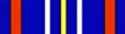

        1. **Purpose:** To recognize leaders within the vUSAF who have distinguished themselves by meritorious achievement and service. The degree of merit must be distinctive, though it need not be unique.

        2. **Criteria:** The vUSAF Airman Commendation Medal (ACM) shall be awarded to senior officers who serve in positions of great responsibility, or to an officer whose direct and individual contributions to vUSAF are recognized as being so exceptional in scope and value as to be equivalent to contributions normally associated with positions encompassing broader responsibilities. This award signifies a milestone of a member\'s virtual career within the vUSAF.

    3. **Distinguished Service Medal**

         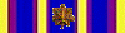 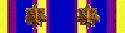

        1. **Purpose:** To recognize those officers who display unwavering dedication and beyond the call of duty.

        2. **Criteria:** The vUSAF Distinguished Service Medal (DSM) is to recognize those officers who display unwavering dedication and professionalism above and beyond the call of duty of the vUSAF. Awarded to members of the vUSAF who distinguished themselves by outstanding non-combat meritorious achievement or service. Normally, the acts or services rendered must be comparable to that required for the Airman Commendation Medal but in a duty of lesser though considerable responsibility.

    4. **Commendation Medal**

        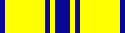

        1. **Purpose:** This medal is awarded to members who, while serving in any capacity with the Virtual US Air Force, shall have distinguished themselves by meritorious achievement and service. The degree of merit must be distinctive, though it need not be unique.

        2. **Criteria:** The vUSAF Commendation Medal may be awarded to members of the vUSAF who while serving in any capacity with the vUSAF, distinguish themselves by outstanding achievement, or by meritorious service not of a sufficient nature to justify a higher award.

        3. **MAJCOM awarding authority.** The MAJCOM/CC may award this Medal for non-combat related excellence **once every six (6) months (2x per year)** with only final review by the Chief of Staff required. The recommendation for the award must be sent up the CoC to the CoS with a notation that the authority of the MAJCOM/CC is being used.

    5. **Achievement Medal**

        

        1. **Purpose:** The vUSAF Achievement Medal may be awarded to members of the vUSAF who while serving in any capacity with the vUSAF distinguish themselves by outstanding achievement or meritorious service but not to the extent that would warrant the award of a Commendation Medal..

        2. **Criteria.** MAJCOM Commanders have the authority to issue this award with the Concurrence of the vUSAF Chief of Staff. Written Commendations must be submitted by the MAJCOM/CC to the Chief of Staff for approval.

        3. **MAJCOM awarding authority.** The MAJCOM/CC may award this Medal for non-combat related excellence **one time per quarter (4X per year)** with only final review by the Chief of Staff required. The recommendation for the award must be sent up the CoC to the CoS with a notation that the authority of the MAJCOM/CC is being used.

    6. **Joint Service Commendation Medal**

        

        1. **Purpose:** To recognize participation in joint service operations where the pilot's performance is meritorious or outstanding.

        2. **Criteria:** The JSAM shall be awarded only to members of the vUSAF who, distinguished themselves by outstanding performance of duty and meritorious achievement in a Joint Service operation.

    7. **Distinguished Flying Cross**

          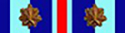 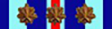 

        1. **Purpose:** This medal is awarded to pilots of the vUSAF who shall have distinguished themselves in simulated combat operations by extraordinary achievement while participating in an aerial flight. It is also given to those who display extraordinary achievement while working as instructors or students at flying schools.

        2. **Criteria:** The Distinguished Flying Cross is awarded to any person who, while serving in any capacity with the vUSAF, distinguishes himself by extraordinary achievement while participating in simulated combat operations during aerial flight. The performance of the act of must be evidenced by voluntary action above and beyond the call of duty. The extraordinary achievement must have resulted in an accomplishment so exceptional and outstanding as to clearly set the individual apart from his comrades or from other persons in similar circumstances and must have been performed in simulated combat.

        1. Guidelines for "extraordinary achievement" are:

            1. 15 or more aircraft shot down in a single operation, or

            2. 30 air-to-ground targets destroyed in a single operation, or

            3. 15 CSAR missions completed in a single operation, or

            4. 15 airdrop missions completed in a single operation, or

            5. Any type of aerial mission that the vUSAF Chief-of-Staff deems equivalent.

    8. **Air Medal**

        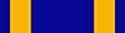 

        1. **Purpose:** This decoration is awarded for acts of outstanding airmanship or meritorious achievements while participating in aerial flight and in actual simulated combat in support of approved operations or exercises. Required achievement must be accomplished with distinction above and beyond that expected of professional airmen.

        1. **Criteria:** Guidelines for "meritorious achievements" are:

            1. Five or more aircraft shot down in a single operation, or

            2. Fifteen air-to-ground targets destroyed in a single operation, or

            3. Five CSAR missions completed in a single operation, or

            4. Ten airdrop missions completed in a single operation, or

            5. Any type of simulated combat aerial mission that the VUSAF Chief of staff deems equivalent.

            6. These achievements must have been performed during simulated combat operation.

    9. **Aerial Achievement Medal**

        

        1. **Purpose:** This decoration is awarded sustained meritorious achievement while participating in aerial flight. The achievements must be accomplished with distinction above and beyond that normally expected of professional airmen. It may also be awarded for acts of airmanship or meritorious achievements lesser than for award of the Air Medal.

        2. **Criteria**

            1. Two or more aircraft shot down in a single operation, or

            2. Five air-to-ground targets destroyed in a single operation, or

            3. Two CSAR missions completed in a single operation, or

            4. Five airdrop missions completed in a single operation, or

            5. Any type of aerial mission that the VUSAF Chief of staff deems equivalent.

        3. **MAJCOM awarding authority.** The MAJCOM/CC may award this Medal for non-combat related excellence one time per year with only final review by the Chief of Staff required. The recommendation for the award must be sent up the CoC to the CoS with a notation that the once-a-year authority of the MAJCOM/CC is being used.

    10. **Unit Citation**

        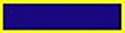

        1. **Purpose:** The purpose of this device is to recognize vUSAF Units for extraordinary participation during vUSAF or VSOA exercises and operations.

        2.  **Criteria:** Unit displays gallantry, determination, and esprit de corps in accomplishing its mission under extremely difficult and hazardous conditions to have set it apart and above other units participating in the same campaign. The degree of heroism required is the same as that which would be required for award of a Distinguished Service Medal to an individual.

    11. **Outstanding Unit Award**

        

        1. **Criteria:** Awarded to units which have distinguished themselves by exceptionally meritorious service or outstanding achievement that clearly sets the unit above and apart from similar units, the services include; performance of exceptionally meritorious service, accomplishment of a specific outstanding achievement of national or international significance, combat operations.

    12. **Combat Readiness Medal**

        

        1. **Purpose:** The purpose of the award is to recognize members for sustained individual combat or mission readiness or preparedness for direct weapon- system employment

        2. **Criteria.** Once UPT, SUPT and MQT training phases have all been completed, the member must complete a cumulative of 12 months of sustained professional performance as a member of vUSAF combat or mission-ready units subject to combat readiness. The term \"Combat Ready\" is defined as maintaining training requirements as assigned by v AFI 11-202 in aircraft that may be used in combat operations.

    13. **Good Conduct Medal**

        

        1. **Criteria.** Awarded to pilots who comply with the vUSAF flight requirements in VAFI 36-100 on schedule and advise when they cannot within a 12-month period.

    14. **Armed Forces Service Medal**

        

        1. **Purpose:** The purpose of this medal is to recognize members of the vUSAF who participate multiple VSOA military operations, as a member of the vUSAF, in a single year.

        2. **Criteria:** The medal is awarded to vUSAF personnel who participate in at least 3 VSOA operations in a single year as a member of the vUSAF.

10. **VUSAF PARTICIPATION AWARDS**

    1. **Operation Hawaii Festival**

        

        1. **Criteria:** Awarded to those members who participated in either the deployment or redeployment, or take part in at least one major operation, or 8 hours.

    2. **Operation Red Flag -- Nellis**

        

        1. **Criteria:** Awarded to those members that have participated in the Red Flag exercises at Nellis AFB.

    3. **Operation Red Flag Alaska**

        

        1. **Criteria:** Awarded to those members that have participated in the Red Flag Alaska exercises at Eielson AFB.

    4. **Operation Sandman**

        

        1. **Criteria:** Awarded to those members that have participated in Operation Sandman.

    5. **Operation Black Forest Award**

        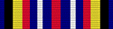

        1. **Criteria:** This award is issued to a pilot who actively participated in vUSAF\'s Operation Black Forest training exercise

    6. **Operation Southern Outlook**

        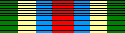

        1. **Criteria:** Awarded to those members that have participated in Operation Southern Outlook.

    7. **Operation Cope Thunder**

        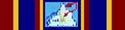

        1. **Criteria:** Awarded to those members that have participated in Operation Cope Thunder.

    8. **Operation Deep Freeze**

        

        1. **Criteria:** Awarded to those members that have participated in Operation Deep Freeze.

    9. **Operation Northern Ice Award**

        

        1. **Criteria:** Awarded to those members that have participated in Operation Northern Ice.

    10. **NATO Joint Services Operations**

        

        1. **Criteria:** Awarded to those members that have participated in NATO Operations or exercises. \*Not currently awarded.

    11. **Expeditionary Medal**

        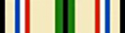

        1. **Criteria:** Awarded to members that have participated in an AEF Operation, and meets at least ONE (1) of the criteria listed below:

            1. Be engaged in direct support of the operation for 15 consecutive days or 30 nonconsecutive days, provided this support involves entering the area of operations.

            2. Serve for the full period where an operation is less than 30 days duration.

            3. Participate as a regularly assigned crewmember of an aircraft flying into, out of, within, or over the area in support of the military operation, in a non- training capacity only.

            4. If one of the above criteria is not met, a recommendation from the Chief of Staff is required.

11. **VUSAF SERVICE AWARDS**

    1. **Humanitarian Service Award**

        

        1. **Criteria:** Awarded to those members who have distinguished themselves by meritorious, direct participation in any significant military act or operation of a humanitarian nature approved by the VUSAF.

    2. **Longevity Award**

         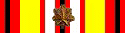 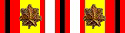 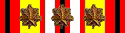 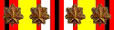 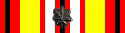 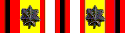

        1. **Criteria:** Awarded to those members who have actively maintained a membership and logged a sortie / ATC control hour once a week for a period of 6 months. For each year thereafter, a member will receive a gold star. On the fifth year the member will receive a silver star.

    3. **UNAF Founder Award**

        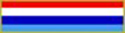

        1. **Criteria:** Award signifies the bearer as one of the original founders of the United Nations Air Forces which was started on SATCO in the year 1999 and later developed into IAMPSO and then current VATSIM SPEC OPS ADMIN. \*No longer awarded.

    4. **VUSAF Founder Award**

        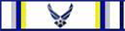

        1. Criteria: Award signifies the bearer is one of the founding members of the vUSAF, which opened on 01-DEC-99 and is considered an owner of the vUSAF. \*No longer awarded.

    5. **AFRC Service Award**

        

        1. Criteria: Award is presented a member to recognize those who have actively served in the vUSAF AFRC MAJCOM for a period of 12 months. \*No longer awarded.

    6. **AETC Service Award**

        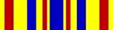

        1. **Criteria:** Award is presented a member to recognize those who have actively served in the vUSAF AETC MAJCOM for a period of 12 months.

    7. **PACAF Service Award**

        

        1. Criteria: Award is presented a member to recognize those who have actively served in the vUSAF PACAF MAJCOM for a period of 12 months.

    8. **USAFE Service Award**

        

        1. Criteria: Award is presented a member to recognize those who have actively served in the vUSAF USAFE MAJCOM for a period of 12 months.

    9. **ACC Service Award**

        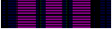

        1. **Criteria:** Award is presented a member to recognize those who have actively served in the vUSAF ACC MAJCOM for a period of 12 months.

    10. **AMC Service Award**

        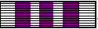

        1. **Criteria:** Award is presented a member to recognize those who have actively served in the vUSAF AMC MAJCOM for a period of 12 months.

    11. **AFSOC Service Award**

        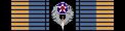

        1. Criteria: Award is presented a member to recognize those who have actively served in the vUSAF AFSOC MAJCOM for a period of 12 months.

    12. **ANG Service Award**

        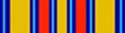

        1. **Criteria:** Award is presented a member to recognize those who have actively served in the vUSAF ANG MAJCOM for a period of 12 months. \*No longer awarded.

    13. **Aerial Demonstration Squadron Award**

        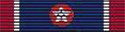

        1. **Criteria:** The purpose of this device is to signify the pilot has been accepted into the Thunderbird Aerial Demonstration Squadron.

12. **VUSAF TRAINING AWARDS**

    Awarded by the AETC Commander upon completion of each training phase.

    1. **MQT Ribbon**

         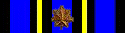  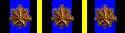 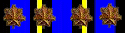 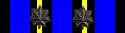 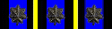

        1. **Criteria:** Award is presented a member to signify the completion of Mission Qualification Training of the pilot training program. A gold star indicates 1 additional MQT course completion, while a silver star denotes 5 additional MQT course completions.

    2. **SUPT Ribbon**

        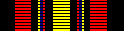

        1. **Criteria:** Award is presented a member to signify the completion of Specialized Undergraduate Training of the pilot training program.

    3. **UPT Ribbon**

        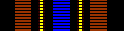

        1. **Criteria:** Award is presented a member to signify the completion of Undergraduate Training of the pilot training program.

    4. **IPT Ribbon**

        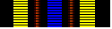

        1. **Criteria:** Award is presented a member to signify the completion of Initial Pilot Training.

13. **GENERAL AWARDS**

    1. **Safety Award**

        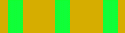

        1. **Criteria:** Awarded to members for the overall lowest FPM landing as calculated by the ACMI log per quarter. Pilots must have met minimum flights per month as outlined in 36-100. \*Not currently awarded.

    2. **ATC Instructor Ribbon**

        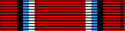

        1. **Criteria:** Award is presented a member to signify completion of the Air Traffic Control Instructor program.

    3. **Instructor Pilot Ribbon**

        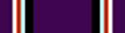  

        1. **Criteria:** Award is presented a member to signify a rated Instructor Pilot for the vUSAF. A silver star indicates a Senior Instructor Pilot and the gold star indicates a Master Instructor Pilot.

    4. **Website Maintenance Ribbon**

        

        1. **Criteria:** Award is presented a member who helps maintain the vUSAF website. Awarded after 6 months of continuous website service.

    5. **Public Relations Ribbon**

        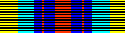

        1. **Criteria:** Award is presented a member who serves the vUSAF as Public Relations officer for a period of 6 months.

    6. **Recruitment Ribbon**

        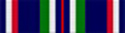

        1. **Criteria:** Recruit two persons into the vUSAF, said recruits shall be active for their first ninety (90) days of their membership and list the recruiting member by name in their application.

    7. **vUSAF Donation Award**

        

        1. **Criteria:** This award is issued to the bearer for their monetary donation to the vUSAF organization that is used to maintain vUSAF web site operations. Various device attachments indicate varying amounts of donation in the following brackets: \$0-\$50, \$51\$100, \$101-\$250, \$251-\$300, \$301-\$350 and \$351+. \*No longer awarded.

14. **RIBBON ATTACHMENT DEVICES**

    1. **Bronze Oak Leaf**

        1. **Criteria:** This device signifies that the bearer has received **ONE** additional award of the ribbon that the oak leaf is attached.

    2. **Silver Oak Leaf**

        1. Criteria: This device signifies that the bearer has received **FIVE}** additional awards of the ribbon that the oak leaf is attached.

    3. **Note:** All ribbons are 125 x 33 pixels in size.

15. **REVIEW BOARD**

    1. **Purpose:** To review recommendations from Senior Command Staff concerning nondiscretionary promotions and awards of all active members of the vUSAF and make recommendations to the Chief of Staff of those found worth and deserving of promotion and recognition.

        The Review Board is discretionary and shall only be appointed if felt necessary by the Chief of Staff.

    2. **Structure:** The Review Board consists of three Senior Command Staff members chosen by the Chief of Staff, who shall serve for twelve-month appointments or a shorter term as chosen by the Chief of Staff. The Review Board will also contain the Deputy Chief of Staff, A3, and a MAJCOM Commander. The Review Board will select a Chairman to preside over meetings of the Board, to communicate with the Senior Command Staff, and to submit the Board's recommendations to the Chief of Staff.

    3. **Meetings:** The Review Board shall convene to consider officers for promotion and recognition as deemed necessary by the Chairman.

    4. **Awards:** The Review Board shall carefully examine the service records, qualifications, and citations of those recommended for Performance and Participation Awards.

    5. **Promotions:** The Review Board shall carefully examine the service records and qualifications for all Officers recommended for non-discretionary promotion above the rank of Captain (O-3). The Board shall only recommend those found meeting the requirements established in v AFI 36-103.

16. **Review Process**

    1. The Senior Command Staff should review the records of all within their Command and ensure that those recommended for promotion and recognition are eligible and meet the criteria for award or promotion. The recommending Senior Command Staff Officer is responsible for preparing and submitting a citation for all Performance Awards.

    2. The Board shall consider all recommendations from Command Staff at the level of MAJCOM Commander or higher.

    3. The Board will review the 201 records of any member recommended for recognition and promotion.

    4. The Board shall vote on those found worthy of recognition and promotion. A quorum is required for all matters presented before the Review Board. A quorum is present when two thirds of the members of the Review Board are present.

    5. The Board shall present a slate of recommendations to the Chief of Staff based on a simple majority vote within 10 days of convening.

    6. The Chief of Staff will accept or reject the recommendations of the Review Board. The Chief of Staff may veto individual recommendations or return the entire slate of recommendations for additional review.

    7. Upon acceptance of the recommendations of the Review Board, the Chief of Staff will announce the names and promotions/awards of those approved.

    8. The Chief of Staff shall submit to the Director of Personnel the names, ranks, and awards of those approved for promotion and recognition. The AF/DP shall immediately update the 201 records of those affected.

// Signed //

Chief of Staff
